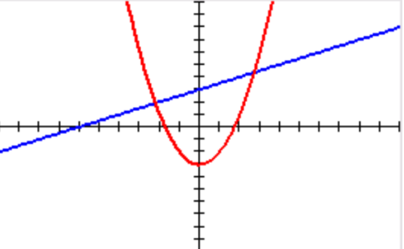

# balderjs-template

## Run
`npm install`  
`npx balderjs`

## Funktioner
Du har tidigare använt funktioner som `read()` och `write()` som läser och skriver. Dessutom har du testat andra typer som t.ex. `circle()` som ritar på skärmen. Det är väldigt vanligt att man både använder och skriver egna funktioner. Bland annat gör det så att om man behöver göra samma sak ofta så slipper man skriva koden för det varje gång, man kan bara göra ett anrop till funktionen (som när man skriver `circle()` t.ex.)

Ett exempel på en funktion:  
```
// Skapar en funktion med namn 'myndig' som tar en variabel 'ålder' som argument.
// 'ålder' måste i det här fallet vara ett nummer (number)
// return är det funktionen ger som svar, man behöver inte ha return om man inte vill.
function myndig(ålder: number) {
    if (ålder < 18) {                  
        return "Du är omyndig."         
    } else {                            
        return "Du är myndig."          
    }
}

write(myndig(20))
write(myndig(10))
```

## Uppgifter
Det som står som kommentar i följande exempel (efter //) är vad programmet ska skriva ut när det körs.

### 1
Skapa en funktion som returnerar summan av de tre tal som skickas in.
```
write(sum3(1, 3, 5)) // 9
write(sum3(2, 4, 6)) // 12
```

### 2
Skapa en funktion som returnerar avståndet (absolutbeloppet) mellan två nummer.
```
write(dist(2, 5)) // 3
write(dist(6, 1)) // 5
```
Det finns en inbyggd funktion `Math.abs` som gör just denna beräkning, men använd inte den i din funktion utan återskapa den för övnings skull.

### 3
Skapa en funktion som returnerar avståndet mellan två punkter (x1, y1) och (x2, y2).
```
write(dist2D(1, 2, 4, 6))   // 5
write(dist2D(1, 2, 13, 7))  // 13
```
I BalderJS finns en funktion distance som gör precis detta, men använd inte den för övnings skull.
I exemplet ovan är argumenten ordnade såhär: `dist2d(x1, y1, x2, y2)`

### 4
Skapa en funktion som returnerar ett boolskt (true eller false) värde som visar om de fyra talen är i växande ordning. Om två tal efter varandra är lika räknas det som att talserien fortfarande växer.
```
write(ascending(1, 2, 3, 4)) // true
write(ascending(5, 6, 8, 7)) // false 
write(ascending(3, 3, 4, 4)) // true
write(ascending(3, 4, 4, 3)) // false
```

### 5
Skapa en funktion min som tar en array med tal som indata och returnerar det minsta värdet.
Använd inte den inbyggda funktion `Math.min` utan lös det med if-satser och loopar för övnings skull.
```
write(min([23, 45, 18, 67]))    // 18
```

### 6
`Math.min` tar inte en lista som argument, utan där skriver man bara in alla tal var för sig. T.ex. `Math.min(2, 6, 1)`. Skriv om din funktion i föregående uppgift så den fungerar på samma sätt som `Math.min`.  Det ska alltså gå att skriva in hur många eller hur få antal tal som helst.  
Tips: Använd [rest parameters](https://developer.mozilla.org/en-US/docs/Web/JavaScript/Reference/Functions/rest_parameters)
```
 write(min2(23, 45, 18, 67))    // 18
```

### 7
Skapa en funktion `prod` som tar en array med tal som indata och returnerar produkten av talen.
```
write(prod([3, 6, 2]))           // 36
```
Extra: läs om [reduce](https://developer.mozilla.org/en-US/docs/Web/JavaScript/Reference/Global_Objects/Array/reduce) men använd inte det i din lösning.

### 8
Skapa en funktion `includes` som tar ett tal och en array med tal som indata och returnerar `true` eller `false` beroende på om det inskickade talet finns i arrayen eller inte.
```
write(inlcudes(3, [5, 7, 2]))    // false
write(inlcudes(3, [5, 7, 3]))    // true
```
Extra: Läs om och testa gärna arraymetoden [includes](https://developer.mozilla.org/en-US/docs/Web/JavaScript/Reference/Global_Objects/Array/includes) men använd den inte i din lösning.

### 9
Skapa funktioner så att dessa rader producerar utskrifterna i kommentarerna.

Använd, för övnings kull, bara if-satser och loopar och inte metoderna `repeat`, `split` eller `join`.
```
visaRepeterat("Hej!", 3)                        // Hej!
                                                // Hej!
                                                // Hej!

visaRepeterat("Balder", 2)                      // Balder
                                                // Balder

visaUppdelat("Apple/Microsoft/Google", "/")     // Apple
                                                // Microsoft
                                                // Google

visaUppdelat("a-b-c-d", "-")                    // a
                                                // b
                                                // c
                                                // d
        
let antal1 = antalMellanslag("Hej på dig!") 
write(antal1)          			                // 2	

let antal2 = antalMellanslag("Balder"); 
write(antal2)          			                // 0		
```
Såhär skulle `repeat`, `split` och `join` kunna användas för att göra samma sak:
```
write("Hej!\n".repeat(3))

write("Balder\n".repeat(2))

write("Apple/Microsoft/Google".split("/").join("\n"))
write()

write("a-b-c-d".split("-").join("\n"))
write()

write("Hej på dig!".split(" ").length - 1)
write()

write("Balder".split(" ").length - 1)
write()            
```

## Extrauppgifter
### 1
Skapa en funktion som returnerar ett boolskt värde som visar om en sträng består av ett enda slags tecken.
```
write( sameChar("aaaaaaaaaa") ) // true
write( sameChar("bbbbcc") )     // false
```
### 2
Skapa en funktion som returnerar ett booleskt värde som visar om ett tal är ett primtal.
```
write( isPrime(15) ) // false 
write( isPrime(17) ) // true
```
### 3
Gör så att man kan mata in funktioner och få dem uppritade som nedan. Välj om du vill att programmet ska fråga användaren efter en funktion eller om du skriver in funktionen direkt i koden. Det blir svårare om användaren ska kunna skriva in en funktion.  

### 4
Tidigare har du stött på uppgifter med loopar som skriver ut t.ex. `4 3 2 1 0 1 2 3 4`. Gör en funktion `bounce` som tar in ett startvärde, räknar ner till 0 och sen upp till startvärdet igen. **Du får inte använda loopar i den här uppgiften.** Du måste utgå från följande funktion och får inte lägga till någon extra hjälpparameter eller hjälpfunktion:
```
function bounce(n: number) {

}
```
Det här är en del av en inlämningsuppgift på introduktionskursen i programmering på LTU.  
Tips: Ta reda på hur rekursion fungerar.